# 🦋 blue-flie

🌀 `@flie` is an [`abcli`](https://github.com/kamangir/awesome-bash-cli) plugin for drone simulation and non-ROS robot control. See [blue-rover](https://github.com/kamangir/blue-rover) for ROS robots.

```bash
pip install blue-flie
```

--table--

```mermaid
graph LR
    gazebo_browse["@gazebo browse~~- <object-name> gui|server"]

    object["📁 object"]:::folder
    UI["🖥️ UI"]:::folder

    object --> gazebo_browse
    gazebo_browse --> object
    gazebo_browse --> UI

    classDef folder fill:#999,stroke:#333,stroke-width:2px;
```



---

--signature--